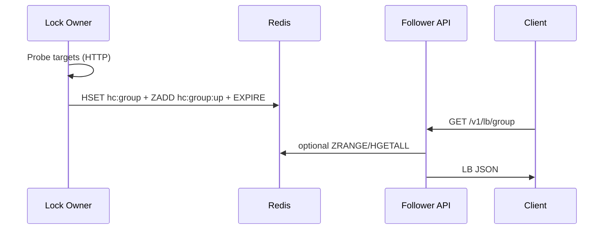

# HA Health Checker & LB - Internal engineering reference

Audience: maintainers and operators.  
For user-facing setup details, see `README.md`.

---

## 1) Product goals

1. Single probe writer: only one replica should actively run health checks in steady state.
2. Highly available read path: every replica serves `/v1/lb` and related APIs.
3. Graceful degradation: `/v1/lb` should still return useful output during Redis trouble (cache + config fallback).
4. Keep deployment simple: no extra proxy service in default Compose.
5. Keep coordination simple: Redis lock instead of a consensus subsystem.

Reliability profile targets:

- `/v1/lb` availability under chaos >= 99.9%
- leader convergence budget <= 15s target (30s hard cap)
- strict release profile treats any degraded warnings as failures

Non-goals for v1:

- persisted consensus log/state
- Redis Sentinel in default stack
- non-HTTP check types

---

## 2) Package layout

Go module: `ha`

| Package | Responsibility |
|---------|----------------|
| `cmd` | Process wiring, Redis lock leadership loop, HTTP server startup, probe lifecycle. |
| `api` | HTTP handlers, LB resolution, Redis reads, cache layers, Prometheus metrics. |
| `checks` | HTTP probe loops and Redis write path (`HSET`, `ZADD/ZREM`, `EXPIRE`). |
| `config` | YAML parsing + validation. |
| `redisstore` | Redis client config from env (`FromEnv`, `NewClient`, `Ping`). |
| `envutil` | Environment helper (`GetDefault`). |
| `logger` | `slog` configuration. |

---

## 3) Runtime architecture

### 3.1 Main goroutines

1. Main goroutine waits for shutdown signals.
2. HTTP server goroutine serves API endpoints.
3. Leader loop goroutine (`leaderLoop`) acquires/renews Redis lock and starts/stops checks.
4. Per-group check goroutines created by `checks.StartHTTPGroup` when leadership is active.

### 3.2 Data flow

### 3.3 Leadership model (Redis lock)

Constants in `cmd/main.go`:

- `leaderLockKey = "ha:leader"`
- `leaderLockTTL = 10s`
- `leaderRenewEvery = 5s`
- `leaderRedisTimeout = 2s`

Acquire path:

- try `SET key nodeID NX EX 10`
- if not acquired, read current owner
- if owner is self (restart race), reclaim via owner-checked renew

Renew path:

- Lua script validates owner (`GET key == nodeID`)
- if owner matches, `EXPIRE key 10`
- if renew fails with a **Redis error**, stop checks then immediately **restart checks without holding the lock** (all replicas do this until Redis is healthy again)
- if renew succeeds but **ownership is lost** (another node holds the key), stop checks and remain a follower

Operational trade-off:

- while Redis is down, **all replicas** run HTTP probes (duplicate outbound checks; Redis writes fail)
- brief duplicate probing is also acceptable during edge races when Redis is up
- simplicity is prioritized over strict single-writer behavior under severe failure

---

## 4) Probe lifecycle

`leaderLoop` controls probing:

- On **Redis lock** gain (`SET NX` or reclaim):
  - update snapshot (`leader=true`, `probes_active=true`)
  - create cancellable context
  - run `startChecks` for all HTTP groups
- On lock loss **with Redis still reachable** (stolen lock):
  - cancel context, drain waitgroups
  - snapshot `leader=false`, `probes_active=false`
- On **Redis errors** while holding or acquiring the lock:
  - cancel prior probe context if any, then start checks again
  - snapshot `leader=false`, `probes_active=true`, `status=degraded` via HTTP

`startChecks` only starts groups with `type: http`.

---

## 5) API behavior

### 5.1 Endpoints

- `/v1/lb/{group}`: primary client endpoint (resilient fallback chain)
- `/v1/check/{group}`: informational endpoint (shows Redis read errors honestly)
- `/v1/leader`: `leader` (holds Redis lock), `probes_active`, `status` (`leader` / `follower` / `degraded`), `node_id`, `since_unix`
- `/ready`: readiness endpoint for orchestrators (503 until safe to serve)
- `/metrics`: Prometheus metrics
- `/health`: process liveness (`{"status":"ok"}`)

### 5.2 `/v1/lb` resolution order

1. fresh LB cache
2. Redis backoff + config fallback
3. strategy-specific fast paths (`:up` zset)
4. full `HGETALL` hydrate path
5. config-only fallback

`/v1/lb` intentionally returns HTTP 200 with structured JSON even during backend failure.

---

## 6) Redis data model

| Key | Type | Content |
|-----|------|---------|
| `ha:leader` | String | Current lock owner (`node_id`) with TTL. |
| `hc:{group}` | Hash | `target -> probeResult JSON`. |
| `hc:{group}:up` | Sorted set | Reachable targets, score = latency ms. |

TTL behavior:

- probe keys use per-target `redis_ttl`
- leader lock uses fixed 10s TTL

---

## 7) Testing and scripts

### 7.2 Python bench harness

Bench execution is Python-first under `scripts/bench/pybench/`.

- CLI entrypoint: `python3 -m scripts.bench.pybench.cli`
- Key commands:
  - `list` - scenario inventory
  - `run --scenario <name>` - single scenario execution
  - `massive` - full-suite regression run
  - `analyze <report_dir> [--json]` - summarize artifacts
- policy profiles:
  - `PYBENCH_PROFILE=pragmatic` for local velocity
  - `PYBENCH_PROFILE=strict` for release/CI gates
  - `PYBENCH_STRICT=true` for explicit strict override

Scenario implementations are in `scripts/bench/pybench/scenarios.py`, using:

- environment lifecycle helpers (`env.py`)
- probe clients and parsers (`probes.py`, `scripts/bench/tools/benchlib/parsing.py`)
- siege adapter (`load_siege.py`)
- structured reporting (`reporting.py`)

Massive run artifacts are per-scenario and deterministic:

- `run.json`
- `events.jsonl`
- `checks.json`
- `summary.txt`
- `summary.json`
- `attachments/`

Run-level rollups:

- `massive-summary.txt`
- `massive-summary.json`

---

## 8) Compose deployment

Reference `docker-compose.yml`:

- one `redis` service
- one `ha` service with `deploy.replicas: 3`
- env includes Redis + app settings only
- only HTTP port exposed for `ha`
- use `/ready` as readiness probe in orchestrated deployments

Kubernetes + systemd references:

- `deploy/k8s/*.yaml`
- `deploy/systemd/ha.service`

---

## 9) Failure model

- Redis down:
  - lock acquire/renew fails on every replica
  - **all replicas run probes** (`probes_active=true`, `status=degraded`); Redis writes fail until recovery
  - `/v1/check` shows Redis errors
  - `/v1/lb` can still serve cache/config fallback
- Leader crash:
  - lock expires in about 10s
  - another replica acquires lock and resumes probes
- short network blips:
  - temporary leadership churn possible
  - short overlap in probing is acceptable

---

## 10) Future work

- optional lock tuning via env (`LOCK_TTL`, `LOCK_RENEW_EVERY`)
- additional check types (TCP, DNS, TLS, gRPC)
- config hot reload
- API authn/authz
- optional Redis HA mode if operating conditions require it

---

## 11) File map

| Path | Notes |
|------|------|
| `cmd/main.go` | Startup, leader lock loop, probe lifecycle. |
| `api/*.go` | HTTP API + LB resolution + cache behavior. |
| `checks/http.go` | Probe execution and Redis writes. |
| `redisstore/redisstore.go` | Redis client setup. |
| `docker-compose.yml` | 3x `ha` replicas + Redis. |
| `scripts/bench/pybench/*.py` | Python-first bench runtime, scenarios, reporting, and analysis. |
| `scripts/bench/tools/massive_runner.py` | Compatibility wrapper to `pybench` massive mode. |
| `scripts/bench/tools/massive_analyze.py` | Compatibility wrapper to `pybench` analyzer. |

This document explains why the system is shaped this way.  
`README.md` remains the runbook for setup and day-to-day usage.
