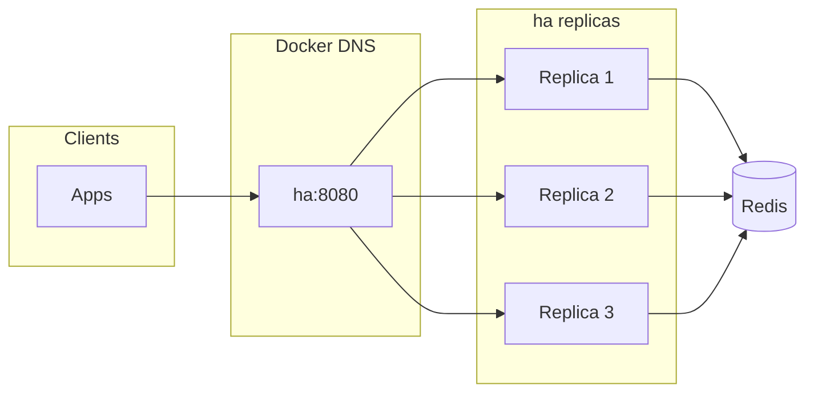

# ha

Distributed HTTP health checker and load-balancing API backed by Redis.  
Every replica serves the API; a Redis lock picks one probe writer when Redis is healthy, and **all** replicas probe if Redis is unreachable.

Scope today: HTTP probes only.

---

## What it does

| Concern | Behavior |
|--------|----------|
| Probes | One lock holder runs probes and writes to Redis; if Redis is down, every replica runs probes (writes fail until Redis is back). |
| Leader lock | Redis key (`SET NX EX`) selects the probe writer when reachable; renew every 5s with 10s TTL. |
| API | All replicas expose `/v1/lb`, `/v1/check`, `/v1/leader`, `/metrics`, `/health`. |
| Client HA | Run multiple replicas and call `ha:8080` on the Docker network (DNS-based fan-out). |



---

## Quickstart

### 1) Configure targets

```bash
cp config-targets.example.yaml config-targets.yaml
# edit targets/check groups as needed
```

### 2) Start stack

```bash
docker compose up --build -d
```

Compose runs one Redis and `ha` with `deploy.replicas: 3`.

### 3) Call API

From another container on same network:

```bash
curl -sS http://ha:8080/v1/lb/web-health
curl -sS http://ha:8080/v1/check/web-health
curl -sS http://ha:8080/v1/leader
curl -sS http://ha:8080/metrics
curl -sS http://ha:8080/health
```

From host, only HTTP is published (port mapping can be pinned to `8080:8080` if desired).

### 4) Local Go build/test

```bash
export GOMODCACHE="${GOMODCACHE:-$HOME/go/pkg/mod}"
go build -o ha ./cmd
go test ./...
```

---

## Endpoints

| Method | Path | Purpose |
|--------|------|---------|
| `GET` | `/v1/check/{group}` | Informational per-target probe state; returns `redis_status=error` when Redis read fails. |
| `GET` | `/v1/lb/{group}` | Primary app endpoint; picks one target using strategy + Redis + cache + config fallback. |
| `GET` | `/v1/leader` | Redis lock + probe state: `leader`, `probes_active`, `status` (`leader` / `follower` / `degraded`), `node_id`, `since_unix`. |
| `GET` | `/metrics` | Prometheus metrics. |
| `GET` | `/health` | Liveness only: always `200` with `{"status":"ok"}` while process is up. |

`/health` is intentionally skipped by request logging middleware to reduce noise.

---

## Leader election model (Redis lock)

Lock key and cadence are fixed in `cmd/main.go`:

- Key: `ha:leader`
- Acquire: `SET ha:leader <node_id> NX EX 10`
- Renew: every 5s while leader holds lock
- Ownership-safe renew: Lua check (`GET key == node_id`) then `EXPIRE key 10`

Behavior:

- Exactly one replica that **holds the Redis lock** runs checks and reports `leader=true`, `probes_active=true`, `status=leader`.
- Other replicas with Redis reachable report `leader=false`, `probes_active=false`, `status=follower` and do not run checks.
- If **Redis is unreachable** (lock acquire/renew errors), **every** replica starts checks so outbound health probes keep running; the API reports `leader=false`, `probes_active=true`, `status=degraded`. Writes to Redis fail until Redis returns; then followers drop checks and lock competition resumes.
- If renew fails because the lock was taken elsewhere, the former leader stops checks (`status=follower`).
- Brief overlap of two lock holders during failure edges is acceptable by design.

---

## `/v1/lb` behavior

- Strategies: `random` (default), `round-robin`, `weighted`, `weighted-rr`
- Per-group override: `checks.<group>.lb.type` in YAML
- Resolution chain (high-level):
  1. Fresh in-process LB cache
  2. Redis backoff path
  3. Fast path via `hc:{group}:up` zset (weighted/random)
  4. Full `HGETALL` hydrate path
  5. Config-only fallback

Design intent: API should keep returning useful LB JSON even when Redis is degraded.

---

## Environment variables

### App

| Variable | Default | Description |
|----------|---------|-------------|
| `CONFIG_PATH` | loader default | Path to config YAML. |
| `LISTEN_ADDR` | `:8080` | HTTP listen address. |
| `LB_STRATEGY` | `random` | Default LB strategy. |
| `LOG_LEVEL` | `warn` | `slog` level. |
| `LOG_FORMAT` | `json` | `json` or `text`. |

### Redis

| Variable | Default | Description |
|----------|---------|-------------|
| `REDIS_ADDR` | `127.0.0.1:6379` | Redis endpoint. |
| `REDIS_PASSWORD` | empty | Redis password if needed. |
| `REDIS_DB` | `0` | Redis logical DB index. |

Reference deployment intentionally keeps Redis simple (single instance in Compose).

---

## Metrics

- `lb_requests_total{path,cache_hit}`
- `lb_latency_ms_*{path}`
- `lb_errors_total{type}`
- `check_requests_total{redis_status}`
- `check_latency_ms_*{redis_status}`
- `check_targets_total{redis_status}`
- `probe_runs_total{check_type}`
- `probe_write_errors_total{check_type}`

---

## Bench and resilience scripts

Scripts live in `scripts/bench/tests/` and share logic in `scripts/bench/lib/common.sh`.

Highlights:

- `resilience.sh` - restart/kill scenarios
- `chaos.sh` - random replica/Redis disruptions
- `churn.sh` - load while leader changes
- `consistency.sh` - with Redis up, only the lock holder increments probes; with Redis check errors, expects all replicas to probe
- `dns_failover.sh`, `full_restart.sh`, `leader_kill_during_probes.sh`, `concurrent_chaos_load.sh`

---

## Troubleshooting

| Symptom | Likely cause | Action |
|---------|--------------|--------|
| `/v1/leader` shows `status=follower` on every replica | Redis reachable but no lock holder yet, or misconfiguration | Wait for acquire; check logs. |
| `/v1/leader` shows `status=degraded` on every replica | Redis unreachable from HA | Expected: all nodes run probes; fix Redis. |
| Leader keeps flipping | Redis latency/timeouts exceed renew window | Check Redis health; tune infra before changing lock constants. |
| Short period with two active checkers | Race around lock expiry/reacquire | Accepted by design; Redis writes are last-write-wins. |
| `/v1/check` returns `redis_status=error` | Redis read path failed | Expected behavior for informational endpoint. |
| `/v1/lb` returns fallback values | Redis degraded or empty dataset | Confirm probes are running and target config is valid. |

---

## License

See `LICENSE`.
